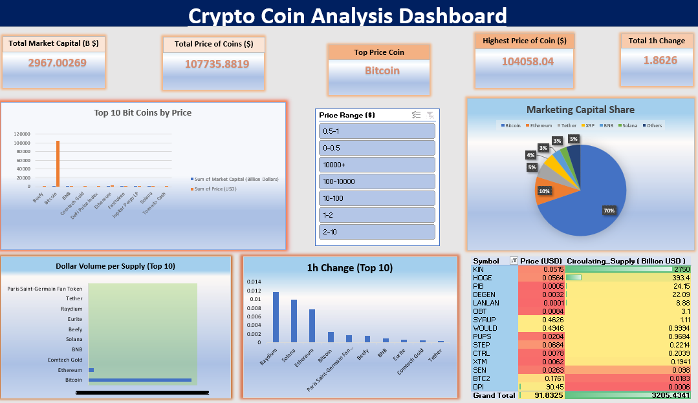

# 🌍 World Crypto Data Analysis Project (MS Excel)



## 📌 Overview
This project presents a comprehensive analysis of global cryptocurrency data using **Microsoft Excel**. It demonstrates how Excel can be used as a powerful data analytics tool for extracting insights from real-world financial datasets.

The project covers the complete pipeline — from **data collection and cleaning** to **interactive dashboard creation and automation using VBA**.

---

## 🌐 Live Dashboard

🔗 **View Online (Excel - OneDrive):**  
https://1drv.ms/x/c/c6b9d2e1fc81ed86/IQBitZ5TmdO2TaFdp58_6cWLAREN5sEa22YiC5bBbuq0YA4?e=HrbHu4  

> ⚠️ Note: VBA features may not work fully in the online version. For full functionality, download and open in Excel desktop.

---

## 🚀 Key Highlights

- 📊 Interactive Excel Dashboard  
- 📈 Crypto Market Trend Analysis  
- ⚡ VBA Automation (Time-based visibility & refresh)  
- 🧠 Data Processing using Python  
- 📉 Advanced Charts & Visual Insights  

---

## 📂 Project Structure
```
├── crypto_data.xlsx # Raw dataset
├── Book1.xlsx # Final dashboard & analysis
├── new.ipynb # Data preprocessing
├── practice.ipynb # Practice work
├── scrap_sample.ipynb # Web scraping sample
├── Web_Scraping.zip # Scraping scripts
├── Dashboard.png # Dashboard preview
└── README.md # Documentation
```

---

## 🎯 Objectives

- Analyze top cryptocurrencies based on:
  - Market Capitalization  
  - Trading Volume (24h)  
  - Price trends  
- Identify market patterns and insights  
- Build a dynamic Excel dashboard  
- Implement automation using VBA  

---

## 🛠️ Tools & Technologies

### 📊 Microsoft Excel
- Pivot Tables  
- Charts (Bar, Line, Pie)  
- Conditional Formatting  
- VBA Automation  

### 🐍 Python (Jupyter Notebook)
- Web Scraping  
- Data Cleaning  
- Data Preparation  

---

## 📊 Dashboard Features

- ✅ Total Market Capital & Price Summary  
- 📈 Top 10 Cryptocurrencies Analysis  
- 🥧 Market Capital Share (Pie Chart)  
- ⏱️ 1-Hour Price Change Tracking  
- 📊 Volume vs Supply Analysis  
- 🎯 Dynamic Price Filters  

---

## ⚙️ Automation (VBA)

- Dashboard visible only between **9 AM – 5 PM**  
- Automatic refresh functionality  
- Dynamic chart updates  

---

## 🔄 Workflow

1. Data Collection (Python Web Scraping)  
2. Data Cleaning & Formatting  
3. Data Import into Excel  
4. Data Analysis (Pivot Tables)  
5. Dashboard Creation  
6. Automation using VBA  

---

## 🚀 How to Use

1. Clone or download this repository  
2. Open `Book1.xlsx`  
3. Enable **Macros (VBA)**  
4. Explore dashboard & interact with filters  

---

## ⚠️ Requirements

- Microsoft Excel (2016 or later recommended)  
- Enable Macros for full functionality  

---

## 👨‍💻 Author

**Divyanshu Mishra**

---

## ⭐ Acknowledgment

This project is created for academic and learning purposes, showcasing practical implementation of **data analytics using Excel**.

---
